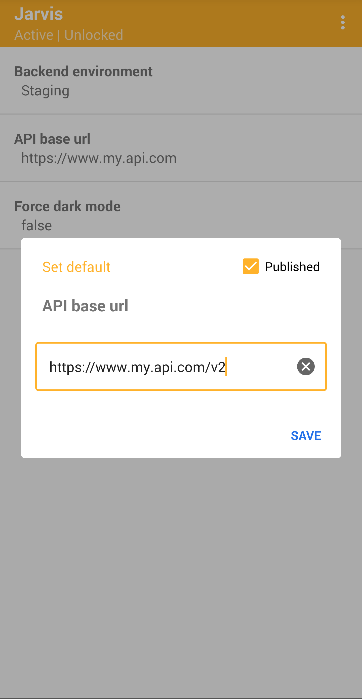

## Injectable app config for Android

<p align="center">
   
</p>

Accelerate your projects with this development tool for Android that provides an instant UI for your app's config and settings. Instant. Easy. Useful.  

- [Who needs it?](#who-needs-it)
- [How does it work?](#how-does-it-work)
- [Quickstart](#quickstart)
- [Future enhancements](#future-enhancements)

### Who needs it?

Use Jarvis if you:
- Need a hidden or "developer only" config menu
- Need editable local config
- Need to override remote config
- Need to easily experiment with complex things such as buffer sizes, thresholds and deltas
- Need a *no-code-change* solution to modifying your app's config and settings

### How does it work?

Jarvis has 2 parts:

1. [JarvisClient](jarvis-client)   
   You integrate this small library with your own app.  
   You define your app's config (in-code) which is pushed to the Jarvis App.
   Values can then be read from the client.

```kotlin
/**
 * 1. Define your app's config
 */
val config = jarvisConfig {

    withLockAfterPush = true

    withStringField {
        name = "Config field name"
        value = "Config value"
    }
}

/**
 * 2. Push your app's config to the Jarvis App
 */
val jarvis = JarvisClient.newInstance(context)
jarvis.pushConfigToJarvisApp(config)

/**
 * 3. Read config values
 */
val value = jarvis.getString("Config field name", "Default value")
```

2. [Jarvis App](jarvis-app)  
   You install this app on the same device as your own app.  
   It receives and renders your app's config which can be edited at runtime.

<p align="center">
     
    
</p>

### Quickstart

See the demos:
1. [jarvis-demo-simple](jarvis-demo-simple): Minimum [JarvisClient](jarvis-client) setup
2. [jarvis-demo-advanced](jarvis-demo-advanced): Integrate [JarvisClient](jarvis-client) only with debug builds

### Future enhancements

1. Auto-restarting of a client app when specific config fields are updated
2. Support multiple client configs at the same time
3. Add a range selector to the Jarvis App UI for numerical field data types
4. Add local notifications to the Jarvis App (e.g: when a new config is received)
