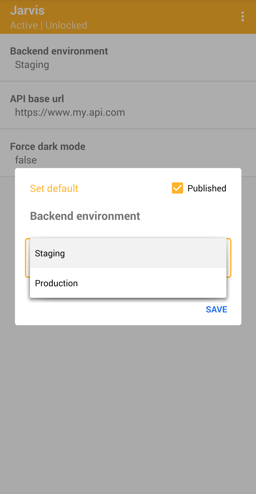

## Jarvis: instant app configuration for Android

   

- [What is it?](#what-is-it)
- [Who needs it?](#who-needs-it)
- [How does it work?](#how-does-it-work)
- [Quickstart](#quickstart)

### What is it?

Jarvis is a development tool for Android that provides an instant UI for your app's config.  

The [JarvisClient](jarvis-client) is used to define your app's config. The [Jarvis App](jarvis-app) allows you to edit & manage that config at runtime with **no code change**.

     
    

### Who needs it?

Use Jarvis if you:
- Need a hidden or "developer only" config menu
- Need editable local config
- Need to override remote config
- Need to easily experiment with complex things such as buffer sizes, thresholds and deltas

### How does it work?

Jarvis has 2 parts:  

1. [JarvisClient](jarvis-client)   
   You integrate this small library with your own app. You define your app's config (in-code) which is pushed to the Jarvis App.

2. [Jarvis App](jarvis-app)  
   You install this app on the same device as your own app. It receives and renders your app's config.

### Quickstart

See the demos:
1. [jarvis-demo-simple](jarvis-demo-simple): Minimum setup in 3 easy steps.
2. [jarvis-demo-advanced](jarvis-demo-advanced): Integrate Jarvis with a *debug-only* build.
