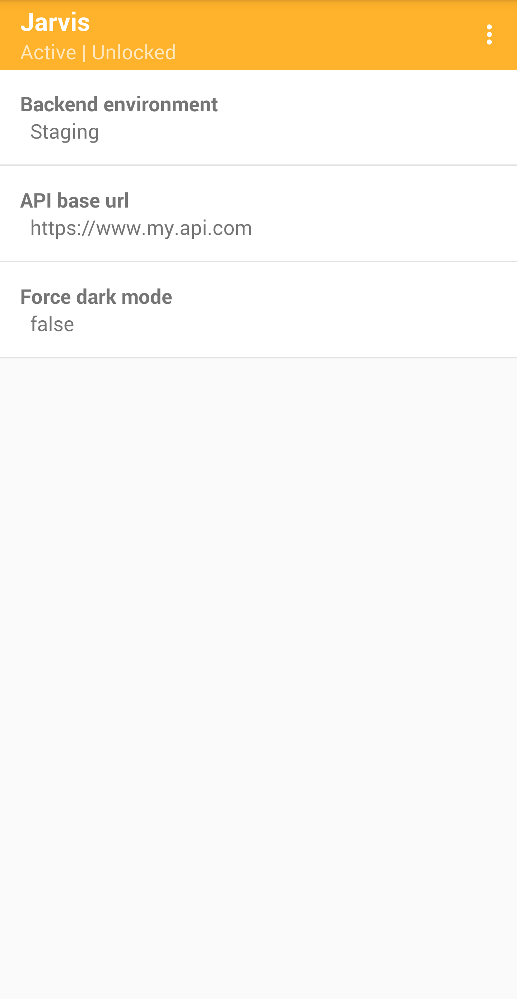

### Jarvis App

This app is installed on the same device as your own app. It receives and renders your app's config with a friendly UI, allowing you to manage and edit it on-the-fly.

- [Where can I get the APK?](#where-can-i-get-the-apk)
- [Must I have the Jarvis App installed?](#must-i-have-the-jarvis-app-installed)
- [Important app concepts](#important-app-concepts)
- [How many concurrent configs does it support?](#how-many-client-app-configs-does-it-support)

   

### Where can I get the APK?

The latest pre-built APK can be downloaded [here](../jarvis-app/prebuilt).

### Must I have the Jarvis App installed?

No. There is **no hard dependency** on this app being installed. It is totally optional.  
If it is installed then the value as defined there will be returned. If it is not installed then the default value (defined by you, in code) is returned.  

### Important app concepts

1. **App Active/Inactive**: Enables & disables the entire Jarvis App  
   *You want to run your app with default values without having to uninstall/reinstall the Jarvis App.*
   - When **Active** The Jarvis App will serve config values to your app.  
   - When **Inactive** the Jarvis App will act like it is not installed.

2. **App Locked/Unlocked**: Enables & disables new config from being accepted  
   *Your app has already pushed its config to the Jarvis App and you don't want to keep overwriting it.*
   - When **locked** the Jarvis App will reject any new incoming configs and maintain its current config state.  
   - When **unlocked** the Jarvis App will accept new incoming configs (removes the existing config).

3. **Fields Published/Unpublished**: Enables & disables individual config fields  
   *You want to enable/disable individual config fields without having to uninstall/reinstall the Jarvis App.*
   - When a config field is **published** it will be returned by the Jarvis App.  
   - When a config field is **unpublished** it will not be returned by the Jarvis App, causing the JarvisClient to return the default value.

### How many client app configs does it support?

One. Supporting multiple installed client app configs will be considered in the future.  
This app can still be used against multiple installed client apps, but only one config will be stored at a time.
