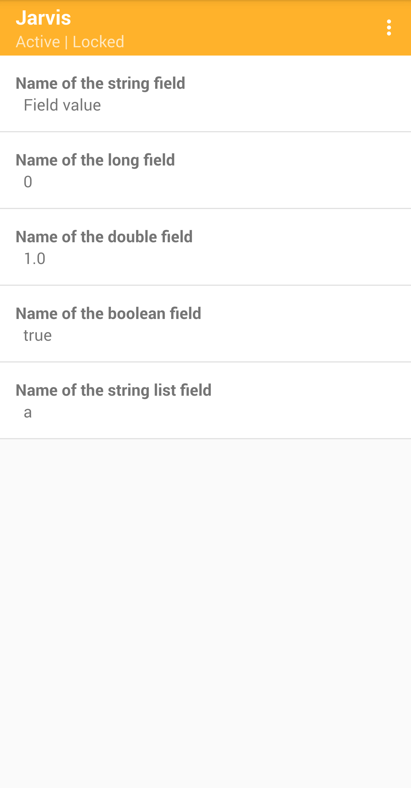

### JarvisClient

This small library communicates with the [Jarvis App](../jarvis-app) to send and receive your app's config. You obtain an instance of [JarvisClient](src/main/java/com/jarvis/client/JarvisClient.kt) to manage a config that you define. Read [the client docs](https://htmlpreview.github.io/?https://github.com/slambang/jarvis/main/docs/index.html).

There are just 4 quick steps to get setup:  
- [1. Gradle dependency and FileProvider](#1-gradle-dependency-and-fileprovider)
- [2. Define a config](#2-define-a-config)
- [3. Push the config to the Jarvis App](#3-push-the-config-to-the-jarvis-app)
- [4. Read values from the JarvisClient](#4-read-values-from-the-jarvisclient)

#### 1. Gradle dependency and FileProvider

Add this dependency to your app's `build.gradle`:

```groovy
implementation 'com.github.slambang:jarvis:<LATEST>'
```

Copy this [FileProvider](https://developer.android.com/reference/androidx/core/content/FileProvider) into your app's `AndroidManifest.xml`. It is required only for the client to push your config to the [Jarvis App](../jarvis-app):

```xml
<provider
    android:name="androidx.core.content.FileProvider"
    android:authorities="${applicationId}.jarvis_config_provider"
    android:exported="false"
    android:grantUriPermissions="true">

    <meta-data
        android:name="android.support.FILE_PROVIDER_PATHS"
        android:resource="@xml/jarvis_client_file_paths" />
</provider>
```

#### 2. Define a config

A Jarvis config is defined in your app which defines config *fields*. Supported field data-types are:
* String
* Long
* Double
* Boolean
* String list (enums)

A helpful builder pattern allows you to define a config like so:

```kotlin
private val config = jarvisConfig {

    withLockAfterPush = true

    withStringField {
        name = "Name of the string field"
        value = "Field value"
    }

    withLongField {
        name = "Name of the long field"
        value = 0L
    }

    withDoubleField {
        name = "Name of the double field"
        value = 1.0
    }

    withBooleanField {
        name = "Name of the boolean field"
        value = true
    }

    // Can also be used for enums
    withStringListField {
        name = "Name of the string list field"
        value = listOf("a", "b", "c")
        defaultSelection = 0
    }
}
```

[withLockAfterPush]() tells the [Jarvis App](../jarvis-app) to auto-lock itself after the new config has been stored. This ensures that your app doesn't keep overwriting the config every time it starts.

#### 3. Push the config to the Jarvis App

Once you have a config it must be sent to the [Jarvis App](../jarvis-app) before any values are read.  The Jarvis App must be ***installed and unlocked*** to accept a new config from the client. Any existing config stored in the [Jarvis App](../jarvis-app) will be removed before the new config is stored.

```kotlin
val jarvis: JarvisClient = JarvisClient.newInstance(context)
val result = jarvis.pushConfigToJarvisApp(config)
```

Now open the [Jarvis App](../jarvis-app) and the new config will be rendered:



#### 4. Read values from the JarvisClient

Now you can begin reading values from the client. The client will first try to read the value from the [Jarvis App](../jarvis-app). If it is installed then the value as defined there will be returned. If it is not installed then the default value is returned.

Every field data-type has both a direct and lazy default value getter:

```kotlin
val jarvis: JarvisClient = JarvisClient.newInstance(context)
val directStringValue = jarvis.getString("Name of the string field", "Default value")
val lazyStringValue = jarvis.getString("Name of the string field") { "Default value" }
```
